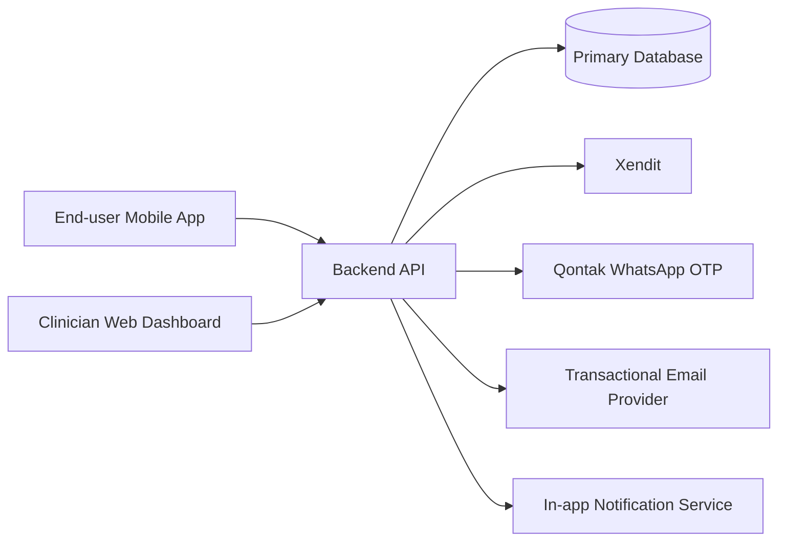

# Mental Wellbeing Tracker — Requirements & Analysis Document

**Version:** 1.0  
**Prepared by:** Requirement Analysis (BA)  
**Date:** 2026-03-12  
**Status:** **DRAFT — Pending Gap Resolution**

---

## 1. Executive Summary

This project is a cross-platform mobile application (Android + iOS) to help individuals track mental wellbeing through mood logging and habit tracking, combined with a clinician-supported subscription model. Users can subscribe, get assigned to a clinician, and consult via real-time chat while monitoring their own progress over time.

Success is defined as reaching at least **10,000 active users in 6 months** and **25,000 active users in 12 months**. The intended go-live target is **5–6 months from development start** with a total budget of approximately **100M IDR** across design, mobile, backend, PM, and DevOps, with team members also supporting other projects (reduced effective capacity).

The largest project risk is **scope vs budget/timeline mismatch**, primarily driven by the combination of subscription billing, WhatsApp OTP verification, real-time chat, clinician dashboard, audit requirements, and bilingual support in a single MVP.

---

## 2. Reference Analysis

| ID | Reference | Type | What's Relevant | What's Different |
|----|-----------|------|-----------------|------------------|
| REF-001 | [Headspace](https://www.headspace.com/headspace-subscription) | Competitor app/site | Calm tone, subscription framing, friendly 2D illustration vibe, onboarding clarity | This product includes clinician assignment + chat and habit/mood tracking as core |

**Visual direction (client):** Blue themed, nostalgic vibe, calming font, cartoon-like 2D graphics with warm tones.

---

## 3. Business Requirements

### 3.1 Problem Statement
Individuals struggling with mental health often lack consistent tools and support to track their wellbeing and sustain helpful habits. The product aims to support behavior change and self-awareness through tracking and clinician guidance, delivered via mobile with a subscription model.

### 3.2 Business Objectives
- Increase product adoption to **10k active users within 6 months**.
- Grow to **25k active users within 12 months**.
- Enable a monetization path via **subscription** tied to clinician support.

### 3.3 Business Requirements (BR)

| Field | Value |
|-------|-------|
| **ID** | BR-001 |
| **Title** | Support mental wellbeing tracking |
| **Description** | The system shall allow users to record and review mood logs and habit check-ins to track wellbeing over time. |
| **Priority** | Must |
| **Rationale** | Core product value for individuals. |
| **Source** | Client |
| **Linked Objective** | Adoption targets |
| **Acceptance Criteria** | Given a logged-in user, When they log mood/habit entries, Then they can view summaries over time. |
| **Linked Features** | FT-001, FT-002, FT-007 |

| Field | Value |
|-------|-------|
| **ID** | BR-002 |
| **Title** | Enable clinician-supported subscription model |
| **Description** | The system shall support paid subscription that links users to assigned clinicians who can observe user progress and provide feedback over a defined period. |
| **Priority** | Must |
| **Rationale** | Monetization and differentiated value through clinician support. |
| **Source** | Client |
| **Linked Objective** | Monetization + adoption |
| **Acceptance Criteria** | Given a subscribed user, When they access clinician features, Then they can communicate with the assigned clinician and the clinician can view that user's data. |
| **Linked Features** | FT-003, FT-004, FT-005, FT-006 |

| Field | Value |
|-------|-------|
| **ID** | BR-003 |
| **Title** | Provide bilingual experience |
| **Description** | The system shall provide an Indonesian and English UI from launch. |
| **Priority** | Must |
| **Rationale** | Launch requirement. |
| **Source** | Client |
| **Linked Objective** | Adoption |
| **Acceptance Criteria** | Given a user, When they change language in settings, Then the UI switches language across key screens. |
| **Linked Features** | FT-009 |

### 3.4 Stakeholder / User Role Map

| ID | Stakeholder / Role | Involvement | Decision Authority |
|----|---------------------|-------------|-------------------|
| UR-001 | Individual end-user | Primary | Product scope decisions (client) |
| UR-002 | Clinician | Primary | Clinical workflow inputs (client) |
| UR-003 | Client business owner | High | Final scope/budget decisions |
| UR-004 | Internal team (PM/Design/Dev/DevOps/QA) | High | Delivery execution |

### 3.5 Success Metrics (KPIs)

| KPI | Baseline | Target (6mo) | Target (12mo) | Measurement Method |
|-----|----------|--------------|---------------|-------------------|
| Active users | [GAP-001: Baseline active users — Owner: Client] | 10,000 | 25,000 | Define “active user” event + window (e.g., 30-day active) |

### 3.6 Constraints & Assumptions

| ID | Type | Description | Impact if Wrong | Validation Method |
|----|------|------------|----------------|------------------|
| C-001 | Constraint | Budget ~100M IDR for entire project | Scope must be reduced or timeline/budget increases | Client confirmation |
| A-001 | Assumption | “Active user” definition will be clarified (DAU/MAU and core action) | KPI tracking may be invalid | Product analytics definition |
| A-002 | Assumption | Team is partially allocated despite “full time” | Timeline risk increases | Confirm effective allocation % |

---

## 4. UX & Design Requirements

### 4.1 Design Ownership & Resources
Design is owned by the project’s **in-house designer**. Client provides a visual direction, not a complete design system.

### 4.2 Personas (high-level)
**UR-001: Individual end-user**
- General consumer, mixed technical literacy.
- Needs low-friction logging, supportive tone, privacy reassurance.

**UR-002: Clinician**
- Needs a clear list of assigned users and a simple way to review progress and respond.

### 4.3 Critical User Journeys (MVP)

**UJ-001: Onboarding (Free vs Subscription)**
- User opens app → splash explains what is free vs subscription → proceed to register/login → can use free mood tracker.

**UJ-002: Subscribe and get clinician assignment**
- User selects plan → completes payment → system assigns clinician (or user selects clinician) → clinician access enabled → chat available.

**UJ-003: Daily tracking**
- User logs mood and habit check-in → user views progress report.

**UJ-004: Clinician review and feedback**
- Clinician logs in via web dashboard → views assigned user list → opens a user → sees trends → sends feedback via chat.

### 4.4 UI/UX Constraints & Requirements

| Requirement | Specification | Notes |
|-------------|--------------|------|
| Visual style | Blue theme, nostalgic vibe, calming font, warm-tone 2D cartoons | Inspired by REF-001 |
| Device support | Android + iOS | Cross-platform |
| Languages | Indonesian + English | MVP |
| Accessibility | [GAP-002: Accessibility target (e.g. WCAG / OS text scaling expectations) — Owner: Client] | Important for general consumers |

---

## 5. Technical Specifications

### 5.1 System Overview (proposed)

### 5.2 Scope of Development

| Layer | In Scope | Notes |
|-------|----------|------|
| Mobile app | Yes | Cross-platform (Flutter or React Native) |
| Clinician dashboard | Yes | Web dashboard, separate login/role |
| Backend API | Yes | Auth, subscription, chat, tracking, reporting |
| Database | Yes | Stores user data, logs, chat, audit |
| DevOps / deployment | Yes | SEA region hosting, CI/CD, monitoring |

### 5.3 MVP Feature Specifications (Option A — agreed MVP package)

| Field | Value |
|-------|-------|
| **ID** | FT-001 |
| **Name** | Authentication & verification |
| **Description** | Users register with phone + email; both collected. Phone verification via WhatsApp OTP (Qontak). Email verification for MVP is **deferred** (see gaps/decisions). Login supports phone or email. Sessions expire after 30 days. |
| **User Roles** | UR-001 |
| **Linked Requirements** | BR-001, BR-002 |
| **Dependencies** | INT-002 (Qontak) |
| **Complexity** | L |

| Field | Value |
|-------|-------|
| **ID** | FT-002 |
| **Name** | Mood logging |
| **Description** | Allow users to log mood entries and review mood over time. |
| **User Roles** | UR-001 |
| **Linked Requirements** | BR-001 |
| **Complexity** | M |

| Field | Value |
|-------|-------|
| **ID** | FT-003 |
| **Name** | Habit tracking & check-ins |
| **Description** | Allow users to define/choose habits and record check-ins; show streaks and summaries. |
| **User Roles** | UR-001 |
| **Linked Requirements** | BR-001 |
| **Complexity** | M |

| Field | Value |
|-------|-------|
| **ID** | FT-004 |
| **Name** | Subscription billing |
| **Description** | Support subscription purchase through Xendit and store subscription status. |
| **User Roles** | UR-001 |
| **Linked Requirements** | BR-002 |
| **Dependencies** | INT-001 (Xendit) |
| **Complexity** | L–XL (depends on recurring/trial/refund rules) |

| Field | Value |
|-------|-------|
| **ID** | FT-005 |
| **Name** | Clinician assignment & access control |
| **Description** | Link subscribed users to assigned clinicians. Clinicians can access only assigned users. Maintain audit logs of clinician access. |
| **User Roles** | UR-001, UR-002 |
| **Linked Requirements** | BR-002 |
| **Complexity** | L |

| Field | Value |
|-------|-------|
| **ID** | FT-006 |
| **Name** | Real-time chat (user ↔ assigned clinician) |
| **Description** | Provide real-time messaging between the user and assigned clinician. |
| **User Roles** | UR-001, UR-002 |
| **Linked Requirements** | BR-002 |
| **Complexity** | XL |

| Field | Value |
|-------|-------|
| **ID** | FT-007 |
| **Name** | End-user progress reports |
| **Description** | Provide users with reports tracking their own progress (mood over time, habit streaks/summaries). |
| **User Roles** | UR-001 |
| **Linked Requirements** | BR-001 |
| **Complexity** | M |

| Field | Value |
|-------|-------|
| **ID** | FT-008 |
| **Name** | Clinician dashboard views & reports |
| **Description** | Web dashboard allowing clinician login to view assigned users and user trends, and provide feedback via chat. |
| **User Roles** | UR-002 |
| **Linked Requirements** | BR-002 |
| **Complexity** | L–XL (depends on reporting scope) |

| Field | Value |
|-------|-------|
| **ID** | FT-009 |
| **Name** | Language switch (ID/EN) |
| **Description** | Provide Indonesian and English UI from launch. |
| **User Roles** | UR-001, UR-002 |
| **Linked Requirements** | BR-003 |
| **Complexity** | M |

### 5.4 Non-Functional Requirements (NFR)

| ID | Requirement | Specification | Notes |
|----|-------------|--------------|------|
| NFR-001 | Data sensitivity | Treat as sensitive health-related data | Logs + chat + clinician access |
| NFR-002 | Hosting region | Southeast Asia | |
| NFR-003 | Session expiry | 30 days | |
| NFR-004 | Audit logging | Clinician access should be auditable | Must |
| NFR-005 | Bilingual support | ID + EN from MVP | Must |

---

## 6. Integration Map

| ID | Integration | Type | Direction | Protocol | Auth | Complexity |
|----|------------|------|-----------|----------|------|------------|
| INT-001 | Xendit | Payment gateway | Out + Webhook In | API + Webhooks | API key / signature | L–XL |
| INT-002 | Qontak WhatsApp OTP | Messaging/OTP | Out | API | API key | M |
| INT-003 | Transactional email provider | Email verification + notifications | Out | SMTP/API | API key | M |

---

## 7. Risk Register

| ID | Risk Description | Category | Likelihood | Impact | Severity | Mitigation | Owner |
|----|------------------|----------|------------|--------|----------|------------|-------|
| RSK-001 | MVP scope exceeds 100M IDR / 5–6 months given part-time allocation | Scope/Budget | High | High | Critical | Cut scope (Option A), phase features, confirm allocation %, consider async chat | Client + PM |
| RSK-002 | Real-time chat complexity (reliability, security, moderation) | Tech | High | High | Critical | Define “real-time” minimum; start with simple messaging (no presence/read receipts) | Tech Lead |
| RSK-003 | Compliance and privacy risk with health-like data + clinician access | Security/Legal | Med | High | High | Privacy policy, consent flows, encryption, audit logs, least-privilege | Client + Security |
| RSK-004 | App store review risk if privacy disclosures unclear | External | Med | Med | Med | Ensure consent, disclosures, data handling documentation | PM |

---

## 8. Scope Boundary Statement

### 8.1 In Scope (MVP)
Option A MVP includes: authentication (phone OTP), subscription billing (Xendit), clinician assignment & web dashboard, real-time chat, mood logging, habit tracking, end-user progress reports, bilingual UI, and basic settings/profile.

### 8.2 In Scope (Post-Launch)
- Journaling with text + media uploads
- Exercises/games/quizzes and relaxing content
- Notifications (reminders), richer reporting, and expanded clinician reports

### 8.3 Explicitly Out of Scope
- Medication tracking
- Any offline medical decision-making; clinician recommendation remains offline

### 8.4 Pending Scope Decisions
| Feature / Decision | Decision Owner | Deadline | Impact if Delayed |
|-------------------|----------------|----------|-------------------|
| Email verification in MVP vs later | Client | Pre-dev | Impacts auth & compliance posture |
| Chat feature depth (read receipts, attachments, typing, calls) | Client | Pre-dev | Major timeline/budget impact |
| Subscription rules (plans, trial, recurring, refunds) | Client | Pre-dev | Payment complexity changes significantly |

---

## 9. Mandays Estimation Matrix (High-level)

This is a coarse estimate to support the **budget vs scope** discussion; it must be refined after UI flows and payment/chat rules are finalized.

| ID | Feature / Component | Mobile | Web (Clinician) | BE | QA | DevOps | Total |
|----|----------------------|-------:|----------------:|---:|---:|------:|------:|
| FT-001 | Auth + WhatsApp OTP | 6 | 2 | 10 | 5 | 1 | 24 |
| FT-002 | Mood logging + charts | 8 | 2 | 6 | 5 | 0 | 21 |
| FT-003 | Habits + streaks | 8 | 2 | 6 | 5 | 0 | 21 |
| FT-004 | Xendit subscription + webhooks | 6 | 2 | 12 | 6 | 1 | 27 |
| FT-005 | Clinician assignment + RBAC + audit | 4 | 6 | 10 | 5 | 1 | 26 |
| FT-006 | Real-time chat (minimal) | 14 | 8 | 20 | 10 | 2 | 54 |
| FT-007 | End-user reports | 6 | 0 | 4 | 4 | 0 | 14 |
| FT-008 | Clinician dashboard MVP | 0 | 14 | 10 | 8 | 1 | 33 |
| FT-009 | Bilingual (ID/EN) | 4 | 2 | 2 | 2 | 0 | 12 |
| — | **TOTAL (engineering)** | **56** | **38** | **80** | **50** | **6** | **230** |

**Interpretation:** ~230 mandays engineering effort (excluding PM/design buffers) strongly suggests budget pressure given **100M IDR total** and partial allocation. If budget is fixed, consider reducing chat scope (async), reducing reporting, and/or simplifying subscription rules.

---

## 10. Open Questions & Gaps Log

| ID | Gap Description | Blocking Feature | Owner | Priority | Deadline |
|----|----------------|-----------------|-------|----------|----------|
| GAP-001 | Define “active user” precisely (DAU/MAU window + required core action) | BR-001 | Client | High | Pre-dev |
| GAP-002 | Accessibility baseline requirements (text scaling, contrast, screen reader) | FT-009 | Client | Medium | Sprint 1 |
| GAP-003 | Transactional email provider selection | FT-001 | Client/Tech | High | Pre-dev |
| GAP-004 | Subscription rules: plans, billing period, free trial, cancellation, refunds | FT-004 | Client | Critical | Pre-dev |
| GAP-005 | Chat details: read receipts, attachments, media, moderation, retention | FT-006 | Client | Critical | Pre-dev |
| GAP-006 | Effective team allocation (%) per role across 5–6 months | Timeline | Client/PM | Critical | Pre-dev |

---

## 11. Confidence Score Card

| Dimension | Score | Status | Notes |
|-----------|-------|--------|------|
| Business Clarity | 80% | ⚠️ | KPIs known; “active user” definition pending |
| User Definition | 85% | ✅ | End-user + clinician clear |
| Scope Completeness | 85% | ⚠️ | Core scope clear; chat/payment details still open |
| Design Readiness | 60% | ⚠️ | Visual direction set; flows/screens not yet produced |
| Integration Coverage | 80% | ⚠️ | Xendit + Qontak known; email provider pending |
| Security & Compliance | 70% | ⚠️ | Compliance intent stated; policy details pending |
| Technical Feasibility | 75% | ⚠️ | Cross-platform + web dashboard aligns; real-time chat adds risk |
| Budget Realism | 40% | 🚨 | Current MVP likely exceeds budget with partial allocation |
| Post-Launch Planning | 65% | ⚠️ | 3-month maintenance commitment noted; roadmap broad |
| **Overall** | **71%** | ⚠️ | Proceed with caution; resolve critical gaps before build |

---

## Pre-Development Checklist (required for this DRAFT)

**Critical (blocks development):**
- [ ] GAP-004 subscription rules finalized (trial/cancel/refund)
- [ ] GAP-005 chat scope finalized (minimum viable “real-time”)
- [ ] GAP-006 confirm effective allocation and revise timeline/budget

**High (resolve before Sprint 1 completes):**
- [ ] GAP-001 define “active user” and analytics events
- [ ] GAP-003 choose transactional email provider

