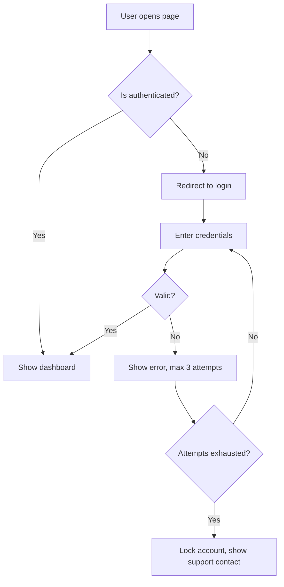
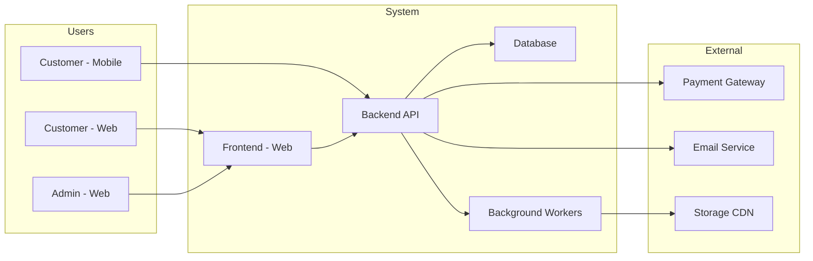
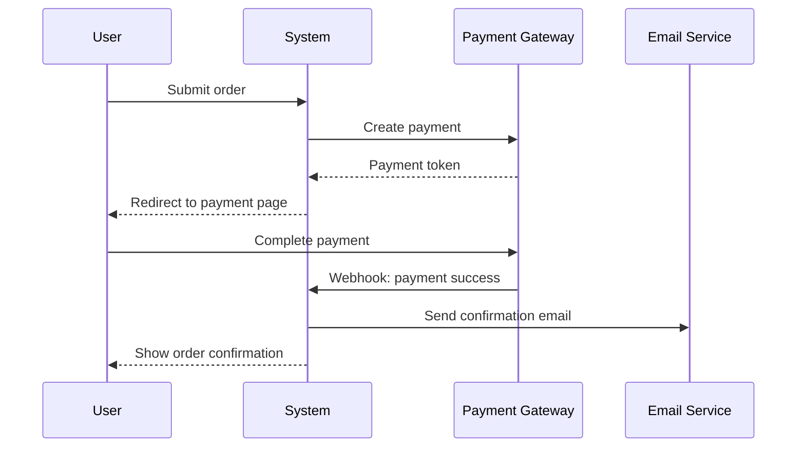
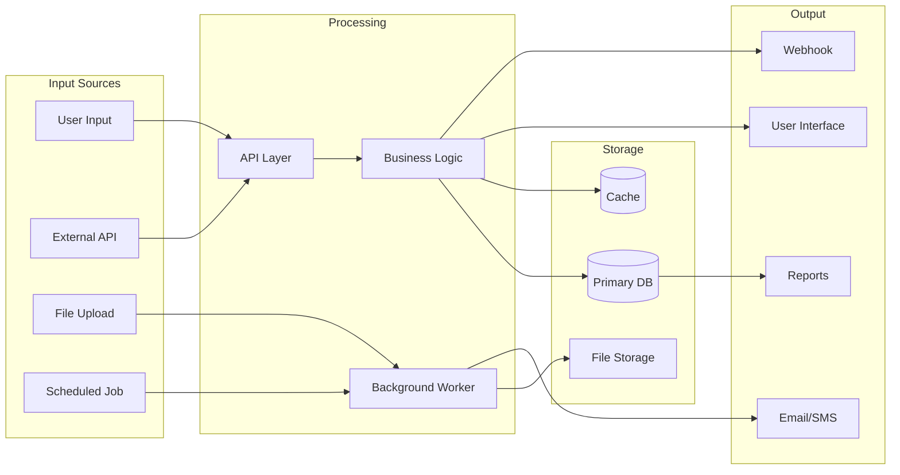
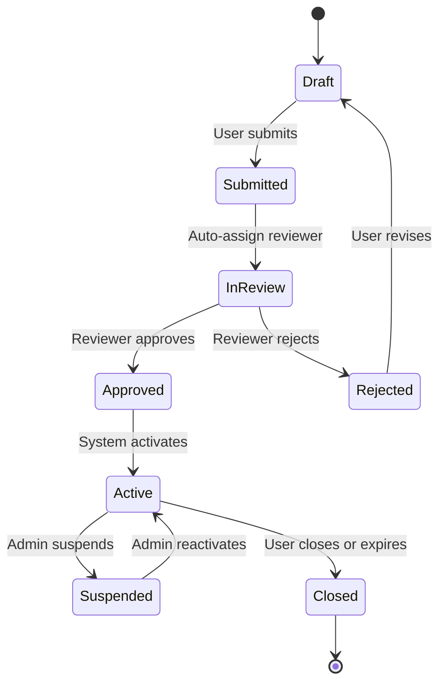

# Source of Truth Document — Output Template

> Read this file at the start of Phase 4 before generating any output.
>
> **CRITICAL: This document must only contain information the user confirmed.**
> Do not write anything as fact that was not explicitly confirmed during the
> interview or in the Phase 3b summary confirmation.
>
> Write in a professional, human tone — not a bullet-dump. Each section should read
> as if a senior BA wrote it. Use full sentences. Be precise.

## Information Classification Tags

Every statement in the document falls into one of three categories. Use these tags
consistently throughout:

**CONFIRMED (no tag needed):** Information the user explicitly confirmed during
the interview or Phase 3b summary. Write as definitive statements.
> Example: "The system shall support 3 user roles: Admin, Seller, and Buyer."

**ASSUMPTION (tag required):** Information inferred from the user's answers but not
explicitly confirmed. Must be flagged so readers know it needs verification.
> Example: `[ASSUMPTION: Image uploads will be limited to 10MB based on typical
> mobile photo sizes — confirm with client]`

**GAP (tag required):** Information that was not provided and could not be inferred.
Must include an owner and priority.
> Example: `[GAP-001: Refund flow undefined — PM to clarify before payment
> feature development begins | Priority: Critical]`

**Rules:**
- When in doubt, tag it as ASSUMPTION. Over-tagging is safer than under-tagging.
- Never fill a GAP with your own judgment and present it as fact.
- Count all ASSUMPTION and GAP tags. If a section has more ASSUMPTIONS than
  CONFIRMED facts, flag that section as low-confidence in the Coverage Checklist.
- Mark the document header as **DRAFT — Pending Gap Resolution** if any Critical
  GAPs exist.
- A document with zero GAPs and zero ASSUMPTIONS → mark as **FINAL**.

---

## Table of Contents

1. [Naming & ID Conventions](#naming--id-conventions)
2. [Section 1: Executive Summary](#section-1-executive-summary)
3. [Section 2: Reference Analysis](#section-2-reference-analysis)
4. [Section 3: Business Requirements](#section-3-business-requirements)
5. [Section 4: UX & Design Requirements](#section-4-ux--design-requirements)
6. [Section 5: Technical Specifications](#section-5-technical-specifications)
7. [Section 6: Integration Map](#section-6-integration-map)
8. [Section 7: Risk Register](#section-7-risk-register)
9. [Section 8: Scope Boundary Statement](#section-8-scope-boundary-statement)
10. [Section 9: Mandays Estimation Matrix](#section-9-mandays-estimation-matrix)
11. [Section 10: Open Questions & Gaps Log](#section-10-open-questions--gaps-log)
12. [Section 11: Confidence Score Card](#section-11-confidence-score-card)
13. [Section 12: Interview Coverage Checklist](#section-12-interview-coverage-checklist)
14. [Appendix: Diagrams](#appendix-diagrams)
15. [Pre-Development Checklist](#pre-development-checklist)

---

## Naming & ID Conventions

Every requirement, feature, risk, and gap gets a unique ID for traceability.

| Entity | ID Format | Example |
|--------|-----------|---------|
| Business Requirement | BR-NNN | BR-001, BR-002 |
| Feature | FT-NNN | FT-001, FT-002 |
| Non-Functional Requirement | NFR-NNN | NFR-001 |
| Integration | INT-NNN | INT-001 |
| Risk | RSK-NNN | RSK-001 |
| Gap | GAP-NNN | GAP-001 |
| User Role | UR-NNN | UR-001 |
| User Journey | UJ-NNN | UJ-001 |
| Reference | REF-NNN | REF-001 |

**Traceability rule:** Every feature (FT) must trace back to at least one business
requirement (BR). Every risk (RSK) must link to the feature or integration it
threatens. Every gap (GAP) must have an owner and a priority.

---

## Section 1: Executive Summary

*Write 2–4 paragraphs. Audience: sales, client stakeholders, C-level.*
*Write this section LAST after all other sections are complete.*

Summarize what is being built, why it matters, who it serves, and what success looks
like. State the go-live target and overall investment (mandays). Flag the single
biggest risk in plain language. Do not use jargon.

```markdown
# [Project Name] — Requirements & Analysis Document

**Version:** 1.0 DRAFT / FINAL
**Prepared by:** AI Requirement Analysis
**Date:** [date]
**Status:** DRAFT — Pending Gap Resolution / FINAL — Ready for Development

## 1. Executive Summary

**Project Name:** [name]
**Client / Business Owner:** [name, role]
**Go-Live Target:** [date or range]
**Total Estimated Effort:** [N] mandays
**Document Status:** [DRAFT / FINAL]

[2-4 paragraphs: what, why, who, success criteria, biggest risk]
```

---

## Section 2: Reference Analysis

*Include this section when the user provided reference material (competitor apps,
screenshots, links, sketches, architectural ideas). Skip if no references were shared.*

*Audience: Everyone — this section aligns the team on what "like X" actually means.*

### 2.1 References Provided

List every reference the user shared and what aspect of it is relevant:

```markdown
| ID | Reference | Type | What's Relevant | What's Different |
|----|-----------|------|----------------|-----------------|
| REF-001 | [name/link] | Competitor app / Screenshot / Sketch / Concept | [specific flows, features, or patterns admired] | [where this project diverges] |
| REF-002 | [name/link] | [type] | [relevant aspects] | [divergences] |
```

### 2.2 Patterns Extracted

For each reference, describe what was extracted and how it maps to this project:

```markdown
**REF-001: [Reference Name]**
- **Admired patterns:** [what the user wants to emulate — specific flows, UI
  conventions, feature behaviors]
- **Mapped to features:** FT-001, FT-003 [link to features this influenced]
- **Mapped to design:** UJ-001 [link to user journeys this shaped]
- **Scale/complexity implied:** [what this reference suggests about expected
  scale, data volume, or technical complexity]
- **Integrations implied:** INT-001 [integrations this reference suggests]
```

### 2.3 Divergences & Customizations

Explicitly state where this project differs from the references. This prevents the
team from building "a clone of X" when the intent was "inspired by X":

```markdown
| Reference | Aspect | Reference Does | This Project Will | Reason |
|-----------|--------|---------------|------------------|--------|
| REF-001 | [area] | [what the reference does] | [what this project does instead] | [why different] |
```

### 2.4 Hidden Complexity Surfaced

List complexity that the references imply but that may not be obvious to the user.
Each item should link to a scope decision (in-scope, out-of-scope, or deferred):

```markdown
| Reference | Hidden Complexity | Effort Implication | Scope Decision |
|-----------|------------------|--------------------|---------------|
| REF-001 | [complexity] | [estimated effort if included] | In scope / Out of scope / Deferred to post-launch |
```

### 2.5 User's Original Ideas

If the user shared their own novel concepts or architectural ideas (not drawn from
an existing reference), document them here with an assessment:

```markdown
**Idea: [Name/Description]**
- **User's vision:** [what they described]
- **Feasibility assessment:** [realistic / needs refinement / significant technical challenge]
- **Impact on scope:** [which features or blocks this affects]
- **Recommendation:** [build as-is / simplify for MVP / defer to post-launch / needs prototyping]
- **Linked features:** FT-NNN
```

---

## Section 3: Business Requirements

*Audience: PM, Business Analyst, client stakeholders.*

### 3.1 Problem Statement
Describe the problem in business terms. Include current state, impact, and who
suffers from it.

### 3.2 Business Objectives
State 3–5 measurable outcomes. Each should be evaluatable at 6 months post-launch.

### 3.3 Business Requirements Table

For each requirement, use this structure:

```markdown
| Field | Value |
|-------|-------|
| **ID** | BR-001 |
| **Title** | [short name] |
| **Description** | [what the business needs — behavior, not implementation] |
| **Priority** | Must / Should / Could / Won't (MoSCoW) |
| **Rationale** | [why this matters — tied to business objective] |
| **Source** | [who requested it: stakeholder name/role] |
| **Linked Objective** | [which business objective from 2.2] |
| **Acceptance Criteria** | Given [context], When [action], Then [outcome] |
| **Linked Features** | FT-001, FT-003 |
```

### 3.4 Stakeholder Map

```markdown
| ID | Stakeholder | Role | Involvement | Decision Authority |
|----|-------------|------|-------------|-------------------|
| UR-001 | [name] | [role] | [level] | [scope] |
```

### 3.5 Success Metrics (KPIs)
Define how success is measured. Include baseline (current state) where known.

```markdown
| KPI | Baseline | Target (6mo) | Measurement Method |
|-----|----------|-------------|-------------------|
| [metric] | [current value or "unknown"] | [target] | [how measured] |
```

### 3.6 Constraints & Assumptions
List all business constraints (budget, regulation, timing) and assumptions made
during analysis. Each assumption must state what happens if it's wrong.

```markdown
| ID | Type | Description | Impact if Wrong | Validation Method |
|----|------|------------|----------------|-------------------|
| A-001 | Assumption | [text] | [consequence] | [how to verify] |
| C-001 | Constraint | [text] | — | — |
```

---

## Section 4: UX & Design Requirements

*Audience: UX/UI Designers, Frontend Developers.*

### 4.1 Design Ownership & Resources
State who is responsible, what assets exist, and delivery timeline.

### 4.2 User Personas
For each user role identified in the stakeholder map:

```markdown
**UR-001: [Role Name]**
- Who they are: [description]
- Technical literacy: [low / medium / high]
- Primary job in the system: [what they do]
- Critical need: [most important thing]
- Biggest frustration with current process: [pain point]
```

### 4.3 Critical User Journeys

For each of the top 3–5 journeys, describe the full flow. Include a Mermaid
diagram for complex journeys.

```markdown
**UJ-001: [Journey Name]**
**Actor:** UR-001 ([role])
**Linked Features:** FT-001, FT-002
**Linked Requirements:** BR-001

1. [Step 1]
2. [Step 2]
3. [Decision point: if X then step 4a, if Y then step 4b]
4a. [Happy path]
4b. [Alternative path]

**Error states:** [what can go wrong and what the user sees]
**Edge cases:** [unusual but valid scenarios]
```

**Mermaid diagram for this journey:**
````markdown

````

### 4.4 UI/UX Constraints & Requirements

| Requirement | Specification | Notes |
|-------------|--------------|-------|
| Design system / brand guideline | [details or GAP] | |
| Device support | [desktop/mobile/tablet] | |
| Browser support | [list] | |
| Page load target | [seconds] | |
| Accessibility | [WCAG level or N/A] | |
| Multilingual | [languages, RTL] | |
| Dark mode / theming | [yes/no/details] | |

### 4.5 Complex Interactions Inventory
List non-standard UI behaviors requiring specific frontend effort:
drag-and-drop, infinite scroll, rich text editor, real-time charts, etc.

---

## Section 5: Technical Specifications

*Audience: Development team, Tech Lead, Architect.*

### 5.1 System Overview
High-level description of the system architecture. Include a Mermaid context
diagram:

````markdown

````

### 5.2 Scope of Development

| Layer | In Scope | Technology / Framework | Notes |
|-------|----------|----------------------|-------|
| Frontend (Web) | Yes/No | [tech] | |
| Backend (API) | Yes/No | [tech] | |
| Mobile (iOS) | Yes/No | [tech] | |
| Mobile (Android) | Yes/No | [tech] | |
| Admin Panel | Yes/No | [tech] | |
| Background Workers | Yes/No | [tech] | |
| DevOps / Infra | Yes/No | [tech] | |

### 5.3 Feature Specifications

For each MVP feature:

```markdown
| Field | Value |
|-------|-------|
| **ID** | FT-001 |
| **Name** | [feature name] |
| **Description** | [what it does — behavior, not implementation] |
| **User Roles** | UR-001, UR-002 |
| **Linked Requirements** | BR-001, BR-003 |
| **Business Rules** | [validations, conditions, constraints] |
| **Edge Cases** | [unusual but valid scenarios to handle] |
| **Dependencies** | FT-002 (requires auth), INT-001 (payment gateway) |
| **Complexity** | S / M / L / XL |
| **Estimated Effort** | [N] mandays |
```

### 5.4 Non-Functional Requirements

```markdown
| ID | Requirement | Specification | Notes |
|----|-------------|--------------|-------|
| NFR-001 | Response time (API) | [target] | |
| NFR-002 | Concurrent users | [target] | |
| NFR-003 | Availability / Uptime | [target] | |
| NFR-004 | Data backup frequency | [target] | |
| NFR-005 | Disaster recovery RTO | [target] | |
```

### 5.5 Architecture Decisions

Document significant decisions and rationale. Use this format:

```markdown
**Decision:** [what was decided]
**Context:** [why this decision was needed]
**Options Considered:**
1. [Option A] — [pros/cons]
2. [Option B] — [pros/cons]
**Chosen:** [which option and why]
**Consequences:** [what this means for the project]
```

---

## Section 6: Integration Map

*Audience: Architect, Tech Lead, Backend Developers.*

### 6.1 Integration Inventory

```markdown
| ID | Integration | Type | Direction | Protocol | Auth | Complexity |
|----|-------------|------|-----------|----------|------|------------|
| INT-001 | [name] | [category] | In/Out/Both | REST/WS/SDK | [method] | S/M/L |
```

### 6.2 Data Flow Description

For each significant integration, describe:
- What data flows, in which direction, triggered by what event
- Error and timeout handling
- Rate limiting or quotas

Include a Mermaid sequence diagram for complex integration flows:

````markdown

````

### 6.3 External Dependencies Risk

| Integration | Criticality | Impact if Unavailable | Fallback Strategy |
|-------------|------------|----------------------|-------------------|
| [name] | High/Med/Low | [what breaks] | [what to do] |

---

## Section 7: Risk Register

*Audience: PM, Tech Lead, Sales.*

```markdown
| ID | Risk Description | Category | Likelihood | Impact | Severity | Mitigation | Owner |
|----|-----------------|----------|------------|--------|----------|------------|-------|
| RSK-001 | [description] | [Tech/Scope/People/External] | H/M/L | H/M/L | Critical/High/Med/Low | [action] | [name] |
```

**Severity = Likelihood × Impact.** Critical risks require active mitigation plans,
not just acknowledgment. Each risk must link to the feature (FT) or integration (INT)
it threatens.

---

## Section 8: Scope Boundary Statement

*Audience: Everyone. This section prevents scope creep.*

### 8.1 In Scope (MVP)
Everything built and delivered in the first release. Reference feature IDs:
- FT-001: [description]
- FT-002: [description]

### 8.2 In Scope (Post-Launch)
Features confirmed for future releases but not MVP:
- [feature] — Target: [release/quarter]

### 8.3 Explicitly Out of Scope
Features the system will NOT include. This list is agreed upon and prevents scope
creep:
- [feature] — Reason: [why excluded]

### 8.4 Pending Scope Decisions
Features not yet decided. Each needs a decision-maker and a deadline:

| Feature | Decision Owner | Deadline | Impact if Delayed |
|---------|---------------|----------|-------------------|
| [feature] | [name/role] | [date] | [consequence] |

---

## Section 9: Mandays Estimation Matrix

*Audience: PM, Sales, Client, Tech Lead.*

### 9.1 Recommended Team Composition

Based on the project scope, present the team the project needs and compare against
what's available. Use `references/manpower.md` for role definitions, seniority
triggers, and rate lookups. Use `references/mandays.md` → "Role Allocation by
Complexity" for minimum role sets per complexity tier.

```markdown
**Rate Card Source:** [Default / Custom — provided by {user}]

| Code | Role | Recommended | Seniority | Allocation | Rate (IDR/hr) | Actual | Gap |
|------|------|-----------|-----------|------------|:-------------:|--------|-----|
| PM | Project Manager | [0/0.5/1] | [Jr/Mid/Sr] | [allocation] | [rate] | [actual] | ✅ / ❌ / ⚠️ |
| SA | System Analyst | [0/0.5/1] | [Jr/Mid/Sr] | [allocation] | [rate] | [actual] | |
| DDA | Data & Digital Analyst | [0/0.5/1] | [Jr/Mid/Sr] | [allocation] | [rate] | [actual] | |
| QA | QA Engineer | [0/1] | [Jr/Mid/Sr] | [allocation] | [rate] | [actual] | |
| FE | Frontend Developer | [1+] | [Jr/Mid/Sr] | Full-time | [rate] | [actual] | |
| BE | Backend Developer | [1+] | [Jr/Mid/Sr] | Full-time | [rate] | [actual] | |
| MOB | Mobile Developer | [0/1/2] | [Jr/Mid/Sr] | [allocation] | [rate] | [actual] | |
| UIUX | UI/UX Designer | [0/0.5/1] | [Jr/Mid/Sr] | [allocation] | [rate] | [actual] | |
| GD | Graphic Designer | [0/0.5/1] | [Jr/Mid/Sr] | [allocation] | [rate] | [actual] | |
| MGD | Motion Graphic Designer | [0/0.5/1] | [Jr/Mid/Sr] | [allocation] | [rate] | [actual] | |
| DO | DevOps Engineer | [0/0.5/1] | [Jr/Mid/Sr] | [allocation] | [rate] | [actual] | |
```

**Legend:** ✅ Role filled adequately | ⚠️ Partially covered or lower seniority than recommended | ❌ Missing — risk accepted or to be addressed

**Gap Resolution Decisions:**
For each ❌ or ⚠️, state what was agreed:
- [Role]: [Resolution — hire, outsource, existing team member covers, scope reduced, risk accepted]

### 9.2 Progressive Estimate Build-Up

Show how the estimate grew as scope was refined:

```markdown
| Layer | Mandays | Source |
|-------|---------|--------|
| Features (Block 3) | [N] | [count] MVP features at estimated complexity |
| + Integrations (Block 5) | +[N] | [count] third-party services |
| + Auth / Security (Block 6) | +[N] | [roles] roles, [auth method] |
| + Mobile multiplier (Block 7) | +[N] | [platforms] × [native/cross-platform] |
| + Admin panel (Block 7) | +[N] | [basic/advanced] |
| + Background workers | +[N] | [count] scheduled/event jobs |
| + DevOps setup | +[N] | CI/CD, staging, production |
| = **Development subtotal** | **[N]** | |
| + QA & Testing ([X]% of dev) | +[N] | |
| + Design ([X]% of dev or fixed) | +[N] | [in-scope / client-provided] |
| + PM / Coordination ([X]%) | +[N] | |
| + SA / BA support | +[N] | |
| + Data migration | +[N] | [if applicable] |
| + Documentation | +[N] | |
| + Buffer / contingency ([X]%) | +[N] | |
| = **Grand Total** | **[N] mandays** | |
```

### 9.3 Effort Breakdown per Feature

Use complexity tiers from `references/mandays.md` and role codes from
`references/manpower.md`:

```markdown
| ID | Feature / Component | Tier | FE | BE | MOB | UIUX | QA | DO | SA | DDA | PM | Total |
|----|--------------------|----|----|----|-----|------|----|----|----|-----|-------|-------|
| FT-001 | [name] | T[1-4] | | | | | | | | | | |
| FT-002 | [name] | T[1-4] | | | | | | | | | | |
| INT-001 | [integration] | — | | | | | | | | | | |
| — | Auth system | — | | | | | | | | | | |
| — | DevOps / CI/CD | — | | | | | | | | | | |
| — | Data migration | — | | | | | | | | | | |
| — | Documentation | — | | | | | | | | | | |
| — | Buffer ([X]%) | — | | | | | | | | | | |
| — | **TOTAL** | | | | | | | | | | | |
```

### 9.4 Team Throughput & Timeline Feasibility

```markdown
**Available team capacity:**

| Role | Headcount | Availability | Mandays/Month |
|------|-----------|-------------|---------------|
| [role] | [N] | [%] full-time | [N × % × 20] |
| [role] | [N] | [%] | |
| **Total capacity** | | | **[N] mandays/month** |

**Timeline calculation:**
- Grand total: [N] mandays
- Team capacity: [M] mandays/month
- Minimum duration: [N ÷ M] months (assuming no blockers)
- Stated deadline: [date]
- Feasibility: ✅ Fits / ⚠️ Tight / ❌ Does not fit

[If ❌: explain what was agreed — scope cut, team added, deadline extended]
```

### 9.5 Cost Projection

Convert mandays to IDR using rates from `references/manpower.md`. Use the confirmed
rate card (default or custom):

```markdown
**Rate Card Source:** [Default / Custom — provided by {user}]

| Role | Mandays | Seniority | Rate (IDR/hr) | Hours | Cost (IDR) |
|------|:-------:|-----------|:-------------:|:-----:|:----------:|
| BE | [N] | [level] | [rate] | [N×8] | [total] |
| FE | [N] | [level] | [rate] | [N×8] | [total] |
| MOB | [N] | [level] | [rate] | [N×8] | [total] |
| QA | [N] | [level] | [rate] | [N×8] | [total] |
| UIUX | [N] | [level] | [rate] | [N×8] | [total] |
| PM | [N] | [level] | [rate] | [N×8] | [total] |
| SA | [N] | [level] | [rate] | [N×8] | [total] |
| DDA | [N] | [level] | [rate] | [N×8] | [total] |
| DO | [N] | [level] | [rate] | [N×8] | [total] |
| GD | [N] | [level] | [rate] | [N×8] | [total] |
| MGD | [N] | [level] | [rate] | [N×8] | [total] |
| Buffer | [N] | — (blended) | [blended rate] | [N×8] | [total] |
| **TOTAL** | **[N]** | | | | **[total IDR]** |
```

### 9.6 Budget vs Scope Assessment

State clearly whether the total estimate aligns with the stated budget. Include
the decision that was made if they didn't align:

```markdown
| Item | Value |
|------|-------|
| Estimated effort | [N] mandays |
| Stated budget | [M] mandays |
| Gap | [N - M] mandays ([%]) |
| Gap status | ✅ Aligned / ⚠️ Moderate gap / ❌ Significant gap |
| Resolution | [What was agreed: scope cut, budget increase, timeline extension, or risk accepted] |

**Features deferred to close the gap:**
- FT-NNN: [feature name] — moved to post-launch
- FT-NNN: [feature name] — moved to post-launch

**Additional budget secured:**
- [Amount] mandays added to cover [scope area]
```

---

## Section 10: Open Questions & Gaps Log

*Audience: PM, Sales — these must be resolved before development begins.*

```markdown
| ID | Gap Description | Blocking Feature | Owner | Priority | Deadline |
|----|----------------|-----------------|-------|----------|----------|
| GAP-001 | [description] | FT-001, FT-003 | [name/role] | Critical/High/Med | [date] |
```

**Instructions:** Each gap represents a decision not made during discovery.
Development should NOT begin on features linked to Critical or High gaps until
resolved. Medium-priority gaps should be resolved in Sprint 1.

---

## Section 11: Confidence Score Card

*Audience: PM, Tech Lead — honest readiness assessment.*

| Dimension | Score | Status | Notes |
|-----------|-------|--------|-------|
| Business Clarity | % | ✅ / ⚠️ / 🚨 | |
| User Definition | % | | |
| Scope Completeness | % | | |
| Design Readiness | % | | |
| Integration Coverage | % | | |
| Security & Compliance | % | | |
| Technical Feasibility | % | | |
| Budget Realism | % | | |
| Post-Launch Planning | % | | |
| **Overall** | % | | |

**Interpretation:**
- 85–100%: Ready to proceed
- 70–84%: Proceed with caution, resolve flagged gaps in Sprint 1
- 55–69%: Significant gaps — resolve before development begins
- Below 55%: Not ready — additional discovery session required

---

## Section 12: Interview Coverage Checklist

*Audience: Everyone — at-a-glance view of what's been covered and what hasn't.*

*This section is ALWAYS included, even for FINAL documents. It serves as an audit
trail of the discovery process and a quick reference for anyone joining the project
late.*

### 12.1 Block Coverage Matrix

```markdown
| # | Block | Status | Confidence | Asked | Answered | Threshold | Key Gaps |
|---|-------|--------|-----------|-------|----------|-----------|----------|
| 1 | Vision & Business Goal | ✅ / ⚠️ / ❌ | __% | _/_ | _/_ | 80% | [list or "None"] |
| 2 | Users & Usage Patterns | | __% | _/_ | _/_ | 75% | |
| 3 | Features & Scope | | __% | _/_ | _/_ | 90% | |
| 4 | Design & UX | | __% | _/_ | _/_ | 70% | |
| 5 | Integrations & Data | | __% | _/_ | _/_ | 85% | |
| 6 | Security & Compliance | | __% | _/_ | _/_ | 80% | |
| 7 | Technology & Architecture | | __% | _/_ | _/_ | 75% | |
| 8 | Team, Budget & Timeline | | __% | _/_ | _/_ | 85% | |
| 9 | Launch & Post-Launch | | __% | _/_ | _/_ | 65% | |
```

**Status legend:**
- ✅ **Covered** — Confidence meets or exceeds threshold. No critical gaps.
- ⚠️ **Partial** — Some answers received but confidence below threshold, or has
  unresolved gaps.
- ❌ **Not Covered** — Block was skipped or user could not provide answers.

### 12.2 Source of Information

State where the information came from per block — this matters for trust and
traceability:

```markdown
| # | Block | Primary Source | Supplemented By |
|---|-------|---------------|----------------|
| 1 | Vision & Business Goal | [Document name / Interview / Both] | [Reference name if any] |
| 2 | Users & Usage Patterns | | |
| ... | ... | ... | ... |
```

### 12.3 Items Pending Confirmation

Items that were extracted from documents or inferred but NOT yet confirmed by the
user. These should be treated as assumptions until confirmed.

```markdown
- [ ] [Block N] [item description] — Needs confirmation from: [person/role]
- [ ] [Block N] [item description] — Needs confirmation from: [person/role]
```

### 12.4 Items Explicitly Deferred

Items the user acknowledged but chose to defer. Include where they were deferred to:

```markdown
- [ ] [Block N] [item description] — Deferred to: [post-launch / Sprint 2 / separate session / TBD]
- [ ] [Block N] [item description] — Deferred to: [target]
```

### 12.5 Coverage Summary

```markdown
**Blocks fully covered (✅):** [N] of 9
**Blocks partially covered (⚠️):** [N] of 9
**Blocks not covered (❌):** [N] of 9
**Overall interview completeness:** [X]%

**Recommendation:**
[One of:]
- "All blocks are sufficiently covered. Document is ready for development."
- "Blocks [list] need additional input before development on related features begins."
- "Significant gaps remain. A follow-up discovery session is recommended covering: [list blocks]."
```

---

## Appendix: Diagrams

Include all Mermaid diagrams referenced in the document, plus these if applicable:

### A.1 System Context Diagram
(included in Section 5.1)

### A.2 User Journey Flows
(included in Section 4.3)

### A.3 Integration Sequence Diagrams
(included in Section 6.2)

### A.4 Data Flow Overview (if complex)

````markdown

````

### A.5 State Machine Diagrams (if applicable)
For entities with complex state transitions (orders, tickets, approvals):

````markdown

````

---

## Pre-Development Checklist

*Only include this section if document status is DRAFT. Remove when all items resolved.*

Before development begins, confirm:

**Critical (blocks development):**
- [ ] GAP-001: [description] — Owner: [name] — Deadline: [date]
- [ ] GAP-002: [description] — Owner: [name] — Deadline: [date]

**High (resolve in Sprint 1):**
- [ ] GAP-003: [description] — Owner: [name]

**Document must be re-issued as FINAL once all Critical items are resolved.**
