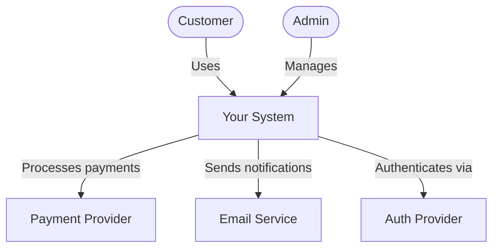
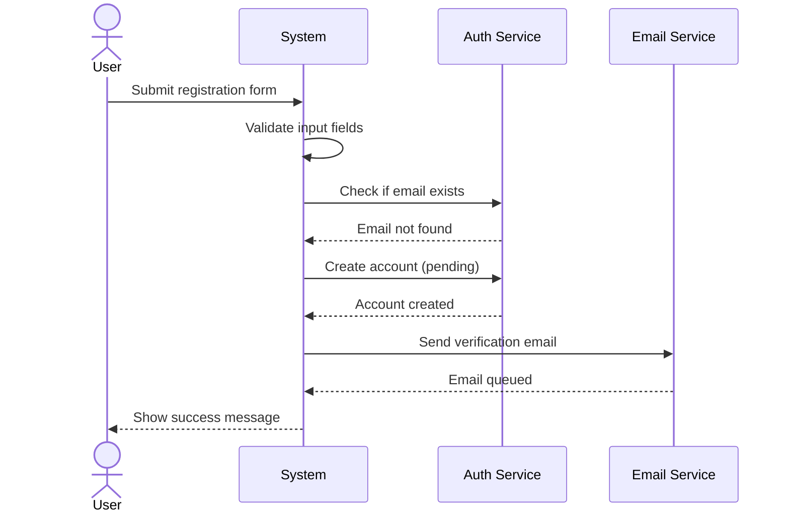
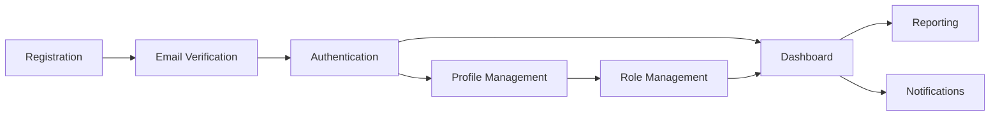
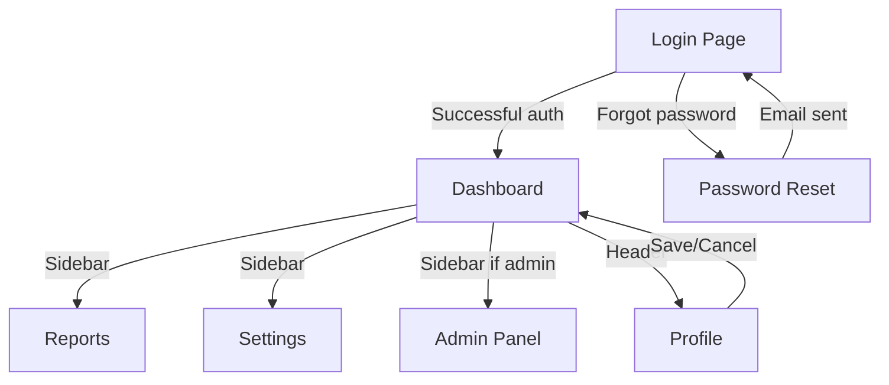
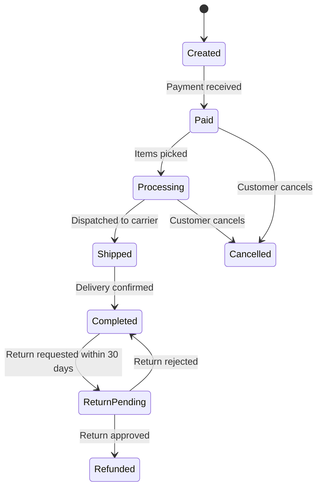
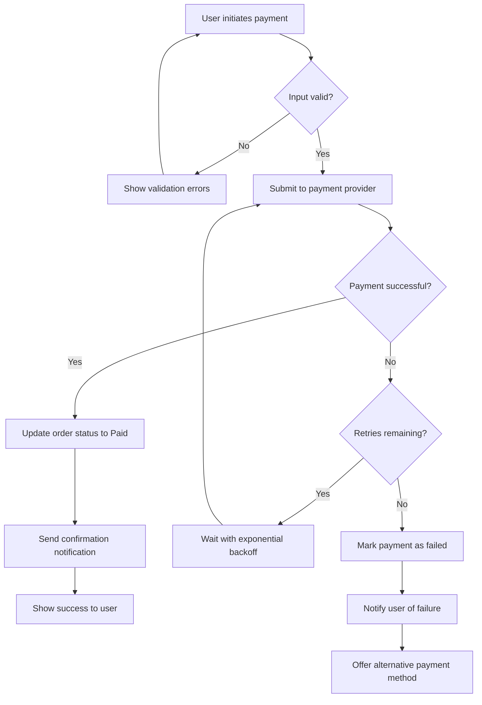

# Functional Specification Document — Template Reference

This file contains the full document template with section-by-section guidance. When generating an FSD, follow this structure and adapt to the project's needs.

**Content rules reminder:** No code samples, no code blocks (except Mermaid), focus on "what" and "why" not "how", use Mermaid exclusively for all visuals, exclude API endpoints and database schemas.

---

## Table of Contents

1. [Introduction](#1-introduction)
2. [Product Overview](#2-product-overview)
3. [Functional Requirements](#3-functional-requirements)
4. [User Interface Requirements](#4-user-interface-requirements)
5. [Non-Functional Requirements](#5-non-functional-requirements)
6. [System Behavior & Error Handling](#6-system-behavior--error-handling)
7. [Approval & Sign-Off](#7-approval--sign-off)
8. [Appendices](#8-appendices)

---

## 1. Introduction

### 1.1 Purpose

State why this document exists and what it defines. Identify the intended audience.

**Example:**
> This document specifies the functional and non-functional requirements for the Acme Inventory Management System v2.0. It is intended for the development team, QA engineers, and project stakeholders. API contracts and database schemas are maintained in their respective specification documents.

### 1.2 Scope

Define the boundaries of the system. What is included and — just as importantly — what is explicitly excluded.

**Example:**
> This specification covers the functional behavior of the web-based inventory dashboard and the mobile stock-check companion app. It does NOT cover API endpoint specifications (see API Spec document), database schema design (see DB Design document), the warehouse hardware, or the legacy ERP migration.

### 1.3 Definitions, Acronyms & Abbreviations

| Term | Definition |
|------|-----------|
| FSD  | Functional Specification Document |
| PRD  | Product Requirements Document |
| UAT  | User Acceptance Testing |
| MoSCoW | Must / Should / Could / Won't prioritization |

Add all domain-specific terms here. Don't assume the reader knows your jargon.

### 1.4 References

List related documents with version numbers and locations.

| Document | Version | Location |
|----------|---------|----------|
| Product Requirements Document | v1.2 | `/docs/PRD-ProjectName.md` |
| API Specification | v1.0 | `/docs/API-Spec-ProjectName.md` |
| Database Design Document | v1.0 | `/docs/DB-Design-ProjectName.md` |
| Brand Style Guide | v2.1 | `https://brand.example.com` |

### 1.5 Document Conventions

Define the requirement language used throughout the document:

- **SHALL / MUST** — The requirement is mandatory. The system will not be accepted without it.
- **SHOULD** — The requirement is important and expected, but can be omitted with justification.
- **MAY / COULD** — The requirement is desirable but optional.
- **WON'T** — Explicitly excluded from this release (but may be considered in the future).

Priority labels follow MoSCoW notation. Requirement IDs use the format `[PREFIX]-[Section].[Subsection].[Number]`, e.g., `FR-3.1.1` for functional requirements, `NFR-5.2.1` for non-functional requirements.

All diagrams in this document use Mermaid format for consistent rendering across tools.

---

## 2. Product Overview

### 2.1 Product Perspective

Describe where this system fits within the larger context. Is it a standalone new product, a replacement for an existing system, a component within a larger platform, or an enhancement to existing functionality?

Include a system context diagram showing the system's boundaries and its interactions with external actors and systems:

### 2.2 Product Functions (High-Level)

Summarize the major capabilities in a bullet list. This is the "elevator pitch" version — details come in Section 3.

**Example:**
- User registration and authentication
- Inventory CRUD operations with real-time stock levels
- Automated low-stock alerts via email and push notification
- Reporting dashboard with export to CSV/PDF
- Role-based access control (Admin, Manager, Viewer)

### 2.3 User Classes & Characteristics

| User Class | Description | Access Level | Technical Proficiency |
|-----------|-------------|--------------|----------------------|
| Admin | System administrators | Full access | High |
| Manager | Department managers | Read/Write within department | Medium |
| Viewer | Read-only stakeholders | Read-only | Low–Medium |

For each user class, describe their goals, frequency of use, and any specific needs.

### 2.4 Operating Environment

Specify the technical environment at a high level:

- **Platforms:** Web (Chrome 90+, Firefox 88+, Safari 14+, Edge 90+), iOS 15+, Android 12+
- **Infrastructure:** Cloud-hosted, multi-region capable
- **Network:** Must function on connections as slow as 3G for mobile app
- **Integrations:** Connects to payment provider, email service, and push notification service

### 2.5 Constraints

List anything that limits design or implementation freedom:

- **Regulatory:** Must comply with GDPR for EU users and CCPA for California residents
- **Technology:** Must use the existing company design system
- **Timeline:** MVP must be delivered by Q3 2026
- **Budget:** Cloud infrastructure budget capped at $5,000/month
- **Legacy:** Must maintain backward compatibility with existing integrations for 6 months post-launch

### 2.6 Assumptions & Dependencies

**Assumptions** (things believed to be true but not confirmed):
- Users have a modern browser with JavaScript enabled
- Peak concurrent users will not exceed 5,000 in the first year
- The existing authentication provider will be retained

**Dependencies** (things that must be in place):
- Payment provider availability
- Design team delivers final mockups by Week 4
- Legal team approves privacy policy language before launch

---

## 3. Functional Requirements

This is the core of the FSD. Every feature is broken down into individually testable requirements.

### 3.1 Feature Breakdown

Organize features into logical groups. Each feature follows this structure:

---

#### FR-3.1: [Feature Group Name]

##### FR-3.1.1: [Specific Requirement Title]

| Field | Value |
|-------|-------|
| **ID** | FR-3.1.1 |
| **Title** | [Short descriptive title] |
| **Description** | [What the system SHALL do — one clear behavioral statement] |
| **Priority** | Must / Should / Could / Won't |
| **Source** | [PRD section, stakeholder name, or user story] |
| **Dependencies** | [Other requirement IDs this depends on, or "None"] |

**Acceptance Criteria:**
- GIVEN [precondition], WHEN [action], THEN [expected result]
- GIVEN [precondition], WHEN [action], THEN [expected result]

**Business Rules:**
- BR-3.1.1a: [Rule description — e.g., "Discount cannot exceed 50% of the item price"]
- BR-3.1.1b: [Rule description]

---

**Example:**

##### FR-3.1.1: User Registration

| Field | Value |
|-------|-------|
| **ID** | FR-3.1.1 |
| **Title** | User Registration |
| **Description** | The system SHALL allow new users to register using an email address and password. Upon successful registration, the system sends a verification email before granting full access. |
| **Priority** | Must |
| **Source** | PRD §2.1, User Story US-001 |
| **Dependencies** | FR-3.2.1 (Email Verification) |

**Acceptance Criteria:**
- GIVEN a visitor on the registration page, WHEN they submit a valid email and password meeting complexity requirements (minimum 8 characters, at least 1 uppercase letter, at least 1 number), THEN an account is created in pending state and a verification email is sent
- GIVEN a visitor on the registration page, WHEN they submit an email already in use, THEN the system displays a generic message without revealing whether the email is registered (to prevent account enumeration)
- GIVEN a visitor on the registration page, WHEN they submit a password that doesn't meet complexity requirements, THEN the system displays specific guidance on which requirements are unmet

**Business Rules:**
- BR-3.1.1a: Email addresses are treated as case-insensitive — "user@example.com" and "User@Example.com" refer to the same account
- BR-3.1.1b: Passwords must never be stored or logged in plaintext — the system uses one-way hashing before persistence

---

### 3.2 Use Cases

Use cases capture how users interact with the system step by step. Include a Mermaid sequence diagram for each complex use case.

#### UC-3.2.1: [Use Case Name]

| Field | Value |
|-------|-------|
| **ID** | UC-3.2.1 |
| **Title** | [Use case name] |
| **Actor(s)** | [Who initiates this — user role or external system] |
| **Preconditions** | [What must be true before this starts] |
| **Postconditions** | [What is true after successful completion] |
| **Priority** | Must / Should / Could / Won't |
| **Related Requirements** | [FR IDs covered by this use case] |

**Main Flow:**
1. [Actor] does [action]
2. System responds with [response]
3. [Actor] does [next action]
4. System [completes the workflow]

**Alternative Flows:**
- **3a.** If [condition], then [alternative behavior]
- **4a.** If [condition], then [alternative behavior]

**Exception Flows:**
- **E1.** If [error condition], the system [error handling behavior]
- **E2.** If [timeout/failure], the system [recovery behavior]

**Sequence Diagram:**

---

### 3.3 Feature Interaction Map

Show how major features relate to each other. This helps the development team understand module boundaries and dependencies.

---

## 4. User Interface Requirements

This section describes the user-facing screens and interactions. It focuses on behavior and structure, not visual design (which belongs in the UI/UX Specification document).

### 4.1 Screen Inventory

List all screens/views in the system with their purpose and user access.

| Screen | Purpose | Accessible By | Entry Points |
|--------|---------|---------------|-------------|
| Login | User authentication | All users (unauthenticated) | Direct URL, redirect from protected pages |
| Dashboard | Overview of key metrics | Authenticated users | Post-login default, sidebar navigation |
| Settings | Account and preference management | Authenticated users | Header menu |
| Admin Panel | System administration | Admin only | Sidebar navigation (admin role) |

### 4.2 Navigation Flow

Describe the navigation structure using a Mermaid flowchart:

### 4.3 Screen Descriptions

For each screen, describe:

- **Screen name and purpose** — What the user accomplishes here
- **Key elements** — Form fields, buttons, tables, navigation components (described textually, not as wireframes)
- **Layout behavior** — How the screen adapts to different viewport sizes (desktop, tablet, mobile)
- **Interaction behavior** — Loading states, hover states, transitions, real-time updates
- **Validation behavior** — When and how input validation occurs (inline, on submit, or both)
- **Accessibility requirements** — Keyboard navigation order, screen reader announcements, focus management

### 4.4 Accessibility Requirements

| ID | Requirement | Standard |
|----|------------|----------|
| UI-4.4.1 | WCAG 2.1 AA compliance across all screens | Must |
| UI-4.4.2 | All interactive elements reachable via keyboard | Must |
| UI-4.4.3 | Screen reader compatible with proper ARIA labels | Must |
| UI-4.4.4 | Color contrast ratio of at least 4.5:1 for body text | Must |
| UI-4.4.5 | Support for browser zoom up to 200% without layout breakage | Should |

---

## 5. Non-Functional Requirements

Every requirement here must have a measurable target. Avoid vague adjectives — "fast" is not a requirement; "responds within 200ms at the 95th percentile" is.

### 5.1 Performance

| ID | Requirement | Target | Measurement Method |
|----|------------|--------|-------------------|
| NFR-5.1.1 | Page load time | Less than 2 seconds on a 4G connection | Lighthouse performance audit |
| NFR-5.1.2 | Core operation response time (p95) | Less than 200ms | Application performance monitoring |
| NFR-5.1.3 | Concurrent users supported | 5,000 simultaneous | Load testing |
| NFR-5.1.4 | Throughput | 1,000 requests per second | Load testing |

### 5.2 Security

| ID | Requirement | Priority |
|----|------------|----------|
| NFR-5.2.1 | All data in transit encrypted via TLS 1.3 | Must |
| NFR-5.2.2 | Passwords hashed using a strong one-way algorithm with appropriate cost factor | Must |
| NFR-5.2.3 | Session tokens expire after 24 hours of inactivity | Must |
| NFR-5.2.4 | Rate limiting on authentication endpoints (maximum 10 attempts per minute per IP) | Must |
| NFR-5.2.5 | OWASP Top 10 vulnerabilities addressed | Must |
| NFR-5.2.6 | Annual third-party penetration testing | Should |

### 5.3 Reliability & Availability

| ID | Requirement | Target |
|----|------------|--------|
| NFR-5.3.1 | System uptime | 99.9% (maximum 8.76 hours downtime per year) |
| NFR-5.3.2 | Recovery Time Objective (RTO) | Less than 1 hour |
| NFR-5.3.3 | Recovery Point Objective (RPO) | Less than 15 minutes |
| NFR-5.3.4 | Automated failover | Active-passive with less than 30 seconds switchover |

### 5.4 Scalability

- **Horizontal scaling:** Application tier must scale to multiple instances behind a load balancer without session affinity
- **Growth projection:** System must support 10x current load within 18 months without fundamental architecture changes
- **Graceful degradation:** Under peak load, non-critical features (e.g., analytics, recommendations) may degrade while core workflows remain fully functional

### 5.5 Maintainability

- **Logging:** Structured logs with correlation IDs across all service interactions for end-to-end traceability
- **Monitoring:** Health check mechanisms on all services; automated alerting when error rate exceeds 1%
- **Deployment:** Zero-downtime deployments via blue-green or rolling update strategy
- **Testing:** Minimum 80% unit test coverage; integration tests for all critical user paths

---

## 6. System Behavior & Error Handling

### 6.1 State Diagrams

Describe key state machines in the system using Mermaid state diagrams. Every entity with a lifecycle (orders, users, payments, tickets, etc.) should have its state transitions documented.

**Example — Order Lifecycle:**

### 6.2 Error Handling Matrix

| Error Code | Condition | User-Facing Message | System Action | Severity |
|-----------|-----------|---------------------|---------------|----------|
| AUTH_001 | Invalid credentials | "Invalid email or password" | Log the attempt, increment failed login counter for the account | Warning |
| AUTH_002 | Rate limit exceeded | "Too many attempts. Try again in 5 minutes" | Temporarily block the IP, alert operations team | Warning |
| PAY_001 | Payment provider timeout | "Payment processing delayed. We'll email you when complete" | Queue the transaction for retry with exponential backoff (3 attempts maximum) | Error |
| SYS_001 | Unhandled system error | "Something went wrong. Our team has been notified" | Log the full error context, alert on-call engineer | Critical |

### 6.3 Edge Cases & Boundary Conditions

Document known edge cases and how the system handles them:

| Scenario | Expected Behavior |
|----------|------------------|
| User submits form with empty required fields | Client-side validation prevents submission; server-side validation returns field-level errors identifying each missing field |
| Two users edit the same record simultaneously | Optimistic locking detects the conflict; the second save is rejected with a message explaining the record was modified and offering to reload |
| File upload exceeds the size limit | Client-side check prevents upload; if bypassed, server rejects with a clear message stating the maximum allowed size |
| User's session expires while filling a form | The system auto-saves draft data periodically; upon re-authentication, the user is offered the option to restore their in-progress work |
| Network disconnection during an operation | The system displays an offline indicator; operations are queued locally and replayed automatically when connectivity is restored |

### 6.4 Critical Flow Diagrams

For complex workflows, include a Mermaid flowchart showing the decision points and error branches:

**Example — Payment Processing Flow:**

---

## 7. Approval & Sign-Off

### 7.1 Stakeholder Sign-Off

| Name | Role | Date | Status |
|------|------|------|--------|
| [Name] | Product Owner | YYYY-MM-DD | Pending / Approved / Rejected |
| [Name] | Tech Lead | YYYY-MM-DD | Pending / Approved / Rejected |
| [Name] | QA Lead | YYYY-MM-DD | Pending / Approved / Rejected |
| [Name] | Design Lead | YYYY-MM-DD | Pending / Approved / Rejected |

### 7.2 Revision History

| Version | Date | Author | Changes |
|---------|------|--------|---------|
| 0.1 | YYYY-MM-DD | [Author] | Initial draft |
| 0.2 | YYYY-MM-DD | [Author] | Revised use cases, added state diagrams |
| 1.0 | YYYY-MM-DD | [Author] | Approved for development |

---

## 8. Appendices

Include supplementary material that supports the spec but would clutter the main sections:

- **Appendix A:** System architecture diagram (Mermaid)
- **Appendix B:** Wireframe references (links to Figma or design tool, not embedded)
- **Appendix C:** Complete feature interaction map (Mermaid)
- **Appendix D:** Glossary of business terms
- **Appendix E:** Competitive analysis or market research (if relevant)
- **Appendix F:** Meeting notes or stakeholder interview transcripts

Note: API endpoint catalogs belong in the API Specification document. Database ERDs belong in the Database Design document. Reference those documents here rather than duplicating their content.

---

## Template Usage Notes

- **Skip sections that don't apply** — but leave a note saying "Not applicable for this project" so readers know it was considered, not forgotten.
- **Cross-reference generously** — link requirement IDs between sections (e.g., a use case should reference the FRs it covers, and the error matrix should reference which flows trigger each error).
- **Keep descriptions concrete** — abstract requirements are ambiguous requirements. Use real user messages, real numbers, real scenarios.
- **Version the document** — every review cycle gets a version bump in the revision history.
- **All diagrams in Mermaid** — never use code blocks, ASCII art, or plaintext diagrams. Mermaid renders consistently across Markdown viewers, GitHub, GitLab, and documentation tools.
- **Reference, don't duplicate** — when API or database details are needed for context, reference the companion specification documents by name and location.
